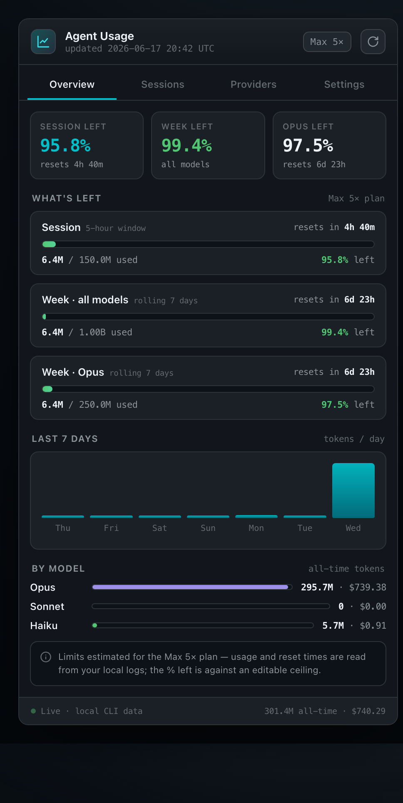
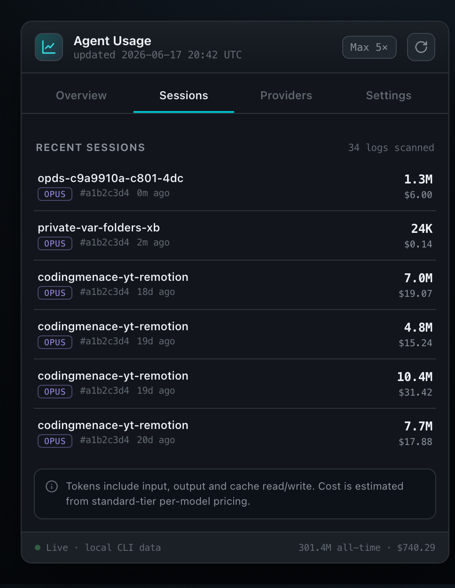
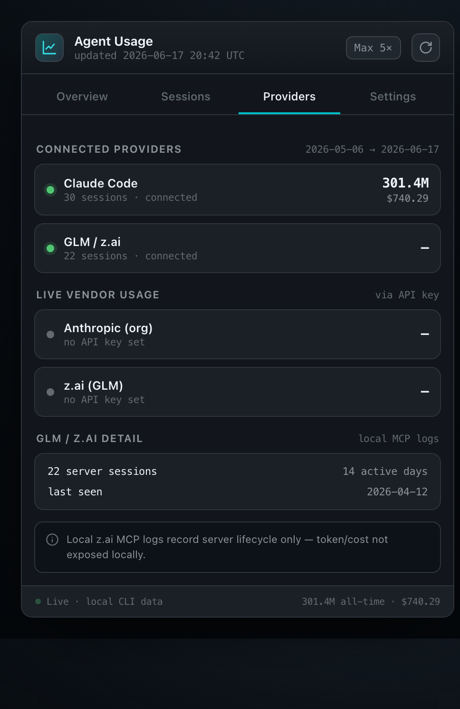
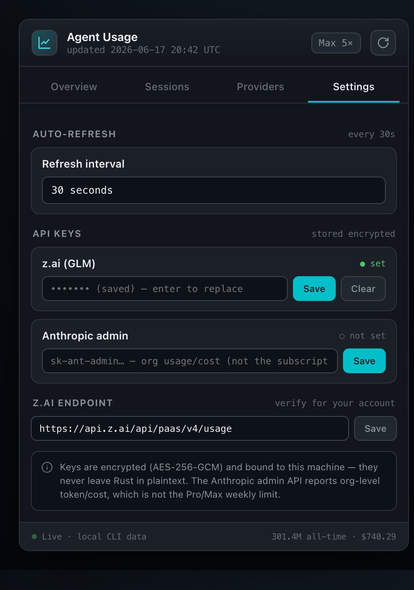
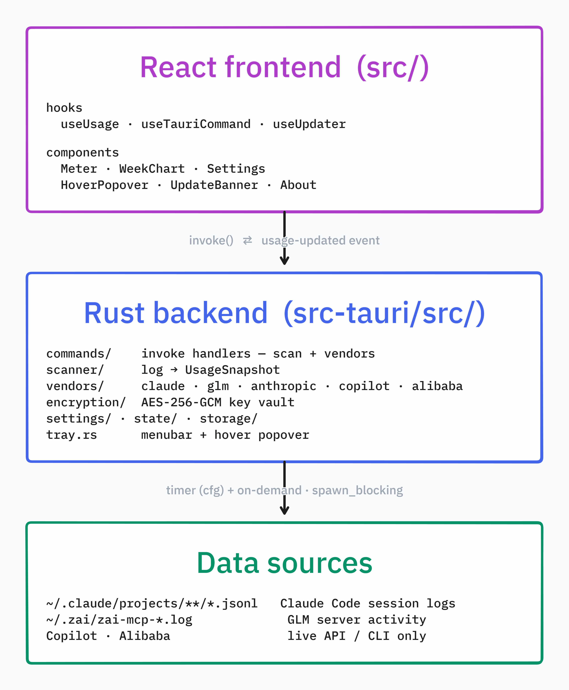

<div align="center">


# Agent Usage Monitor

### A lightweight **menubar widget** that tracks your AI coding agent usage in real time.

Per-provider usage · live vendor quota · token spend · cost estimates · session history — for **Claude Code, GLM/z.ai, GitHub Copilot, Alibaba Bailian, and Kimi Code** — all read from local logs and live APIs, refreshed on a timer, living quietly in your menu bar.

<br/>


<br/>



</div>

---

## ✨ Features

### One widget, five providers
A segmented Overview switches between **Claude Code, GLM/z.ai, GitHub Copilot, Alibaba Bailian, and Kimi Code** — each with its own usage meters and a live reset countdown.

### The data
- **Real token counts.** Exact per-request tokens parsed straight from **Claude Code's session logs** (input, output, cache read/write) and **GLM server activity** from local MCP logs; Copilot and Bailian report live quota straight from their APIs.
- **Cost estimates** for Claude models (Opus / Sonnet / Haiku) from standard-tier pricing, with optional **org-level Anthropic cost** via the admin key. (Other providers don't expose per-token cost locally.)
- **7-day spark chart** + all-time model breakdown + recent-session history, spanning every provider.

### Live vendor data (optional)
Connect any provider for real-time quota and usage — **Claude Code** (in-app OAuth sign-in), **GLM/z.ai** (API key), **GitHub Copilot** (device-flow OAuth), **Alibaba Bailian** (Bailian CLI), or **Kimi Code** (reads the Kimi Code CLI login). All secrets are stored **encrypted and machine-bound**.

### Always current
A Rust timer re-scans and pushes fresh data to the UI — **auto-refresh interval is configurable in Settings (default 30s)**, applied live without a restart. No frozen snapshots.

### Stays out of the way
Menubar-only (`LSUIElement`), click-to-toggle dropdown, single-instance, optional **launch-at-login**, and a **dock/float window mode** (float makes the header a drag handle). A compact **minimal view** trims the Overview to headline stats, and a **tray hover popover** previews the top meters — pick which provider it shows in Settings.

### Self-updating
Signed auto-updates via the Tauri updater — an in-app "Update & restart" banner appears when a newer build ships, and the **tray icon badges** a dot when an update is available.

---

## 🖼️ Screens

<table>
  <tr>
    <td align="center" width="50%">
      <br/>
      <b>Overview</b> — per-provider meters, reset timers, week chart, model split
    </td>
    <td align="center" width="50%">
      <br/>
      <b>Sessions</b> — recent sessions across providers, with project, model, tokens, cost
    </td>
  </tr>
  <tr>
    <td align="center" width="50%">
      <br/>
      <b>Providers</b> — one card per provider (Claude / GLM / Copilot / Alibaba / Kimi): connection status + live usage
    </td>
    <td align="center" width="50%">
      <br/>
      <b>Settings</b> — provider connects, plan tier, refresh interval, encrypted keys
    </td>
  </tr>
</table>

---

## 🏗️ Architecture

A **thin React frontend** that only renders, and a **rich Rust backend** that does all the work.

<p align="center">
  
</p>

The frontend calls invoke handlers and renders the snapshot; the Rust backend does the work — scans logs and fetches live vendor data (off-thread via `spawn_blocking`), merges one `UsageSnapshot`, and emits `usage-updated` to the UI.

---

## 📡 Data sources — what's real vs. estimated

Each provider reports different things. Local data comes from parsing logs on disk; live data is pulled from the provider's API or CLI and is opt-in.

### Claude Code

| Metric | Source | Real? |
| --- | --- | --- |
| Token usage (session / week / model) | `~/.claude/projects/**/*.jsonl` | ✅ exact |
| Cost | derived from per-model pricing | ≈ estimated |
| Reset countdowns | computed from log timestamps | ✅ real |
| "% left" ceilings | editable plan tier (Pro / Max 5× / Max 20×) | ≈ estimated\* |

\* The Pro/Max subscription "weekly % left" has **no public API**, so ceilings are estimates you set by picking your plan.

### GLM / z.ai

| Metric | Source | Real? |
| --- | --- | --- |
| Token / cost (local) | `~/.zai/*.log` — lifecycle only | ❌ shown as `—` |
| 5h / weekly quota (with key) | z.ai monitor API (`/api/monitor/usage/quota/limit`) | ✅ real |
| Monthly tool quota + breakdown (with key) | same endpoint, `TIME_LIMIT` entry | ✅ real |
| Last 7 days chart + per-model tokens (with key) | z.ai monitor API (`/api/monitor/usage/model-usage`) | ✅ real |

### Anthropic (org-level, with admin key)

| Metric | Source | Real? |
| --- | --- | --- |
| Cost | Anthropic Admin Cost API | ✅ real (org-level) |

> Reports **org-level** spend, not your Claude Code subscription quota — it's a separate, complementary metric.

### GitHub Copilot

| Metric | Source | Real? |
| --- | --- | --- |
| Premium-request quota | GitHub `copilot_internal/user` (your editor / `gh` token) | ✅ real (per-user) |
| Session rows (project / model / tokens) | `~/.copilot/session-state/*/events.jsonl` | ✅ exact, but only once a session ends |

> Copilot writes a session's totals when the session shuts down, so a session you're still in shows `—` until you close it. Its second figure is **premium requests**, not dollars.

### Alibaba Bailian

| Metric | Source | Real? |
| --- | --- | --- |
| Usage / quota | Bailian CLI (`bl`) — `bl auth` login | ✅ real (per-account) |

> The console session expires after a few hours, but with OpenAPI AK/SK configured (Settings → Enable auto-refresh) the CLI renews it automatically — the app also retries once on an expired-session error before declaring it dead.

### Kimi Code

| Metric | Source | Real? |
| --- | --- | --- |
| Weekly / 5h quota | Kimi `coding/v1/usages` (the Kimi Code CLI's own OAuth login) | ✅ real (per-user) |
| Extra Usage balance | same endpoint (`boosterWallet`) | ✅ real |
| Session rows (project / model / tokens) | `~/.kimi-code/sessions/**/wire.jsonl` | ✅ exact, per turn |

> Kimi tokens are summed across the main loop **and** every subagent of a session. There's no cost column — the coding plan is flat-rate, so a dollar figure would be invented.

> Kimi access tokens live only ~15 minutes, so an expired login is **renewed in place automatically** using the CLI's stored refresh token (written back to the shared credentials file). Only a dead refresh token asks you to open Kimi Code or run `kimi login` again.

### Sessions ("Recent activity")

Rows come from every CLI that keeps a local session log — Claude, Kimi, and Copilot — interleaved by recency. **GLM contributes real per-hour rows** from the z.ai monitor API (`/api/monitor/usage/model-usage`) when an API key is set — one row per active hour with tokens, call count, and the dominant model, covering activity from any machine, not just this one. Without a key it falls back to a single summary row from the local MCP logs. **Alibaba contributes no rows**: `bl` is a one-shot API client with no session store, and when it's wired into another coding agent that agent's logs are indistinguishable from its own.

Anything a provider doesn't record locally shows `—` rather than a zero.

---

## 🚀 Quick start

```bash
npm install
npm run tauri dev      # develop
npm run tauri build    # bundle an unsigned app for your OS (.app/.dmg on macOS, .exe/.msi on Windows)
```

> **Heads-up:** if your shell sets `NODE_ENV=production`, install with
> `NODE_ENV=development npm install --include=dev` so the dev toolchain is included.

### 📦 Shipping a signed build

For a `.dmg` that installs cleanly on **any** Mac (no Gatekeeper warnings), it
must be **signed with a Developer ID cert and notarized by Apple**:

```bash
cp .env.example .env   # fill in your signing identity + notarization creds
./scripts/release-mac.sh
```

See **[docs/RELEASE.md](docs/RELEASE.md)** for the full runbook (certificates,
notarization credentials, verification, universal builds, troubleshooting).

---

## ⚙️ Configuration

- **Auto-refresh interval** — choose 10s / 15s / 30s / 1m / 2m / 5m in Settings (default **30s**); takes effect on the next cycle.
- **Plan tier** — pick Pro / Max 5× / Max 20× from the header dropdown; it sets the **local-estimate** ceilings for Claude and persists. Live providers (GLM / Copilot / Alibaba / Kimi) report their own limits regardless.
- **Connect providers** (Settings tab) — sign into **Claude Code** (OAuth), connect **GitHub Copilot** (device-flow OAuth), or install + log into the **Alibaba Bailian CLI** — all from inside the app. **Kimi Code** needs no in-app setup: it picks up the Kimi Code CLI's login (`kimi login`) automatically.
- **API keys** (Settings tab) — optional **z.ai** and **Anthropic admin** (`sk-ant-admin…`) keys for live vendor data. (The Anthropic admin key reports org-level cost and is separate from your Claude Code subscription quota.)
- **z.ai endpoint** — editable; confirm it against your account's billing API.
- **Overview providers** — hide or show individual providers on the Overview; pick which one the **tray hover popover** shows.
- **Window mode** — dock (default) or float (header becomes a drag handle); toggle **minimal view** to trim the Overview to headline stats; toggle **launch-at-login**.

### 🔒 Security

API keys are encrypted with **AES-256-GCM** using an **Argon2id**-derived key whose password is this machine's UID — so a `settings.json` copied elsewhere can't be decrypted. Keys never leave Rust in plaintext and are never exposed to the frontend (which only sees `…KeySet` booleans).

---

## 📁 Project structure

```
agent-status/
├── src/                      # React frontend (thin)
│   ├── hooks/                # useTauriCommand, useUpdater, useUsage
│   ├── components/           # About, HoverPopover, Meter, Settings, UpdateBanner, WeekChart
│   └── styles/app.css
└── src-tauri/                # Rust backend (rich)
    └── src/
        ├── commands/         # invoke handlers (collect = scan + vendor)
        ├── scanner/          # log → UsageSnapshot aggregation
        ├── vendors/          # claude · glm · anthropic · copilot · alibaba
        ├── encryption/       # at-rest key vault
        ├── settings/ state/ storage/
        └── tray.rs           # menubar icon + dropdown
```

---

## 🧪 Tests

```bash
cd src-tauri && cargo test --all     # 127 Rust tests: scanner, encryption, vendor parsers
npm test                             # 44 frontend tests: hooks + components
```

CI runs the suite on macOS / Windows / Ubuntu (`.github/workflows/unit-tests.yml`).

---

## 📝 Notes

- **Icons.** The source of truth is `src-tauri/icons/icon.svg`. Regenerating is a two-step process:
  1. **Render the SVG to `icon.png`** (512px, transparent background, all four rounded corners intact). A browser-grade renderer is required — naive exports fill the corners and add edge seams:
     ```bash
     # resvg (pure-Rust, no native deps): install once, then render
     cargo install resvg
     resvg -w 512 -h 512 src-tauri/icons/icon.svg src-tauri/icons/icon.png
     ```
  2. **Derive every platform size** from that `icon.png`:
     ```bash
     npx @tauri-apps/cli icon src-tauri/icons/icon.png
     ```
     This regenerates `32x32.png`, `128x128.png`, `128x128@2x.png`, `icon.ico`, and `icon.icns` (the files `tauri.conf.json` bundles).
  - **Menubar tray icon** — `src-tauri/icons/tray.png` (monochrome template) and its `tray-badge.png` variant are **not** regenerated by `tauri icon`; edit those PNGs directly. They're wired in `src-tauri/src/tray.rs`.
- **Bundle identifier** is `com.dennisrongo.agentstatus` — change in `src-tauri/tauri.conf.json` if distributing under a different org.
- **Signing, notarization & auto-updates** for distribution — see [docs/RELEASE.md](docs/RELEASE.md).
- Live vendor endpoints are best-effort and unverified offline — confirm against your accounts on first run.
